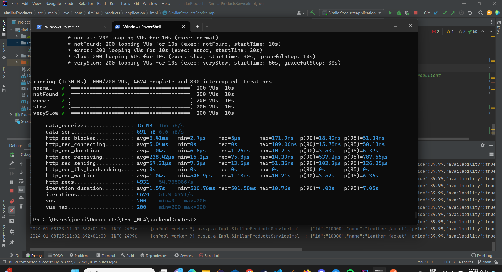
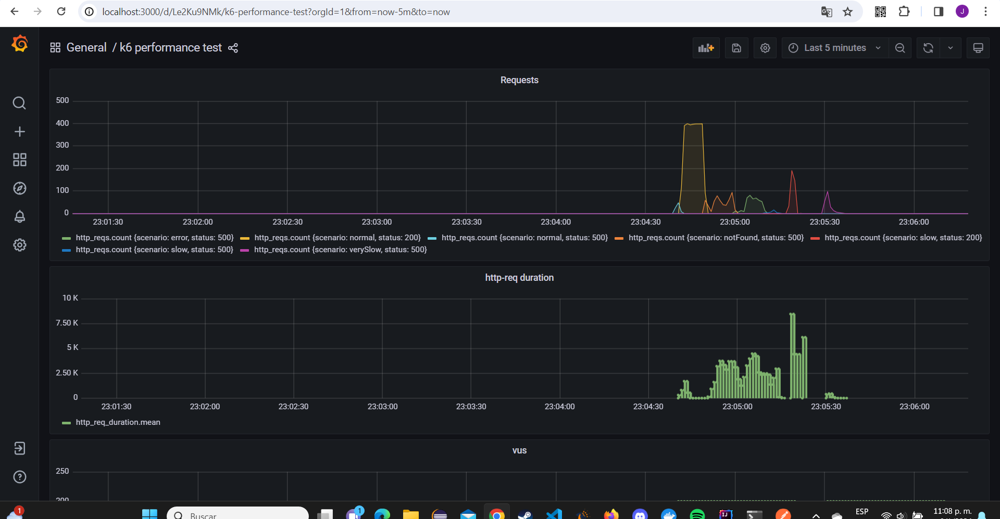
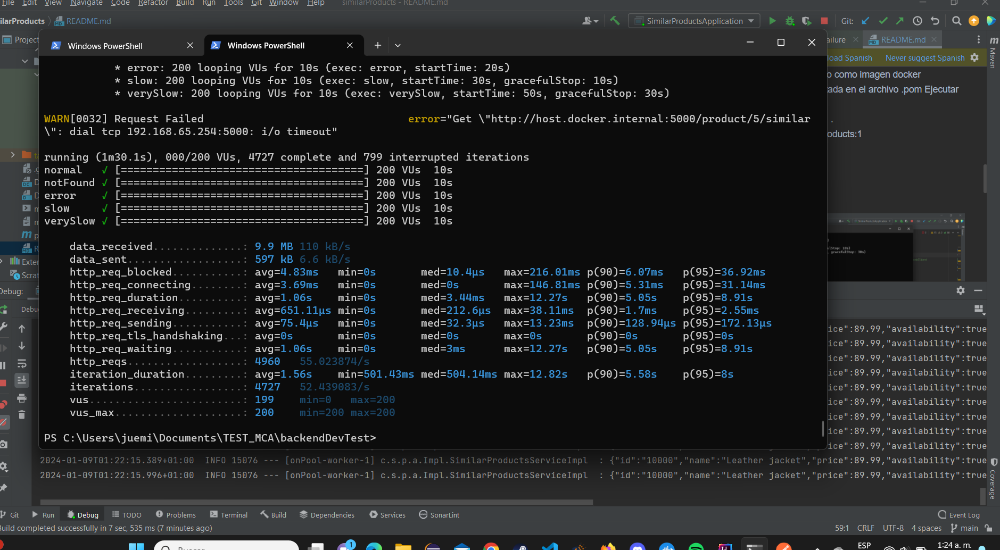
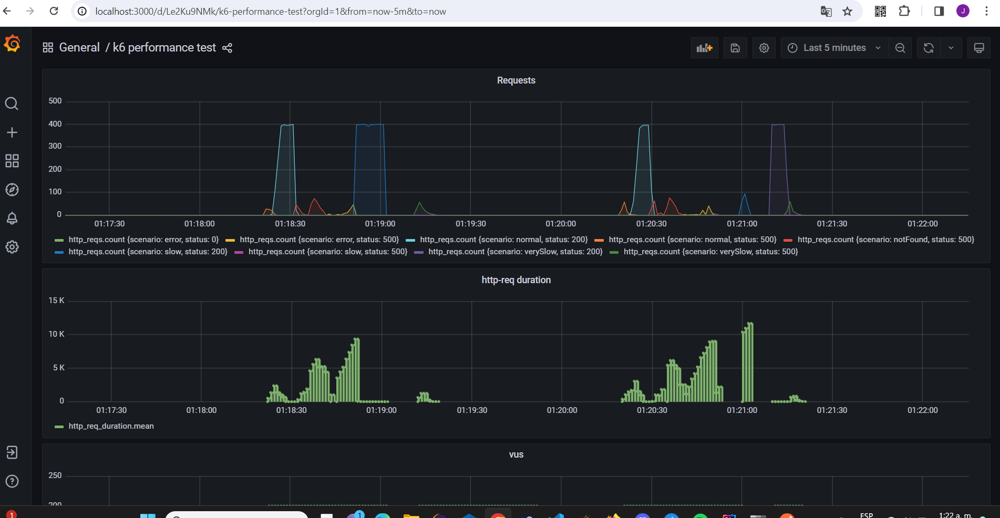

# Similar products

aplicativo Restfull que se encargarara de consultar mocks y devolver (o no depende del mock) una lista de productos similares

##el mismo tiene ejemplo de como implementar: 
    
    1. arquitectura Hexagonal
    2. Docker file
    3. cache con caffeine 
    4. Swagger

## Tabla de Contenidos

- [Instalación](#instalación)
- [Uso](#uso)
- [Configuración](#configuración)
- [Contribución](#contribución)
- [Directorio de Archivos](#directorio-de-archivos)
- [Licencia](#licencia)

## Instalación
    Es necesario tener un minomo de requerimientos para el entorno

    1. Tener JAVA y Maven instalado en el ordenador
    2. ejecutar el comando 'mvn clean install'
    3. ejecutar el comando ' mvn spring-boot:run'

    En caso de querer usar docker compose 
        es necesario descomentar la dependencia en el archivo.pom

## Uso

- [Swagger](#http://localhost:5000/swagger-ui/index.html)
- se pueden realizar llamadas get pero para levantar los mocks es [necesarios seguir las intrucciones del siguiente repositorio](#https://github.com/dalogax/backendDevTest)
- ...

## Configuración

- en caso de querer configurarlo para usarlo como imagen docker
    1. descomentar la dependencia comentada en el archivo .pom
    Ejecutar los siguientes comandos:

        1. docker build -t similar-products:1 .
        2. docker-compose up -d similar-products:1

##Respuesta 
- Ejecucion por shell sin agregar flux

- Grafana sin agregar flux

- Ejecucion por shell con flux

- Grafana sin agregar flux

